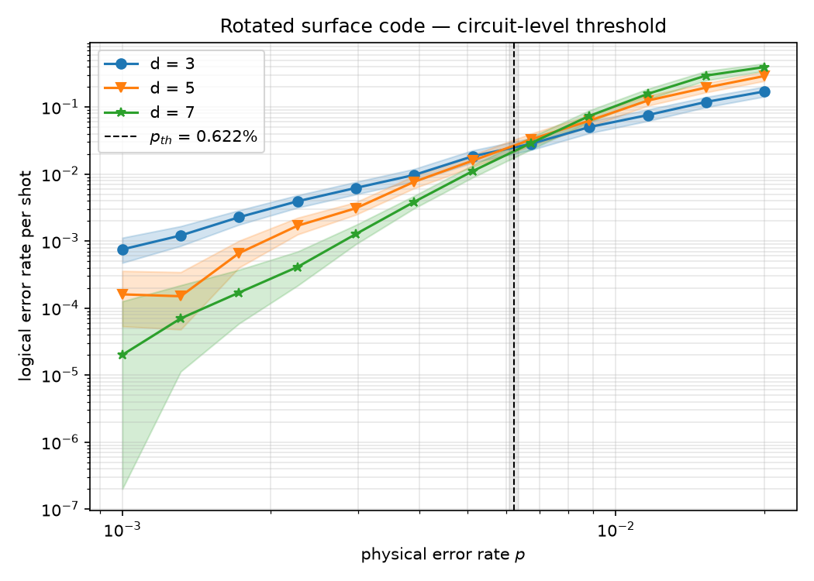
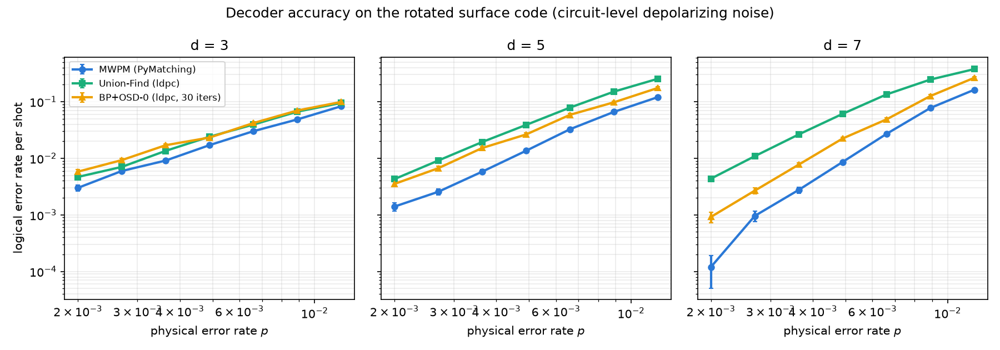
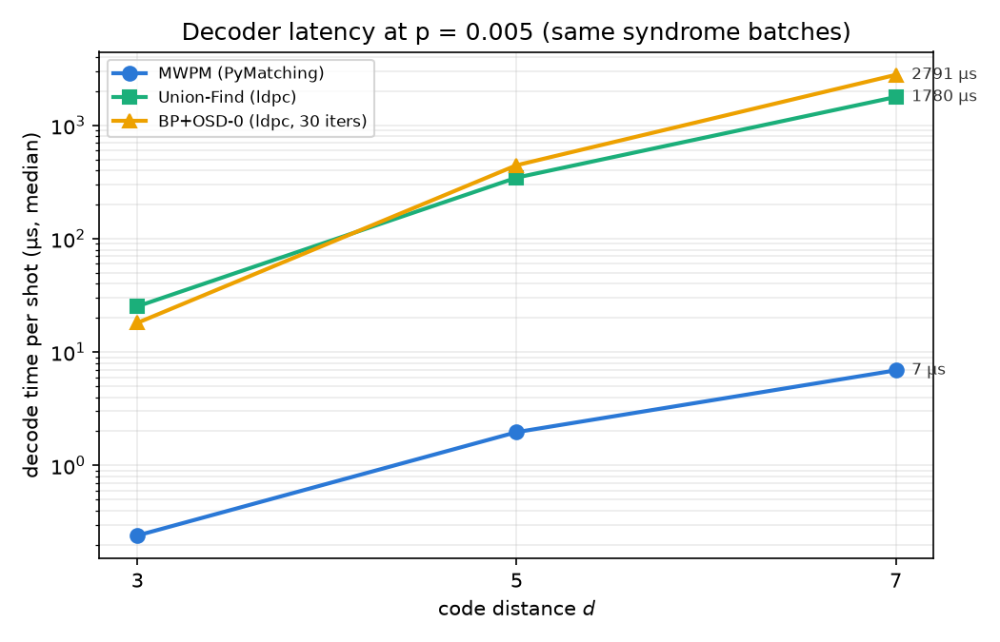
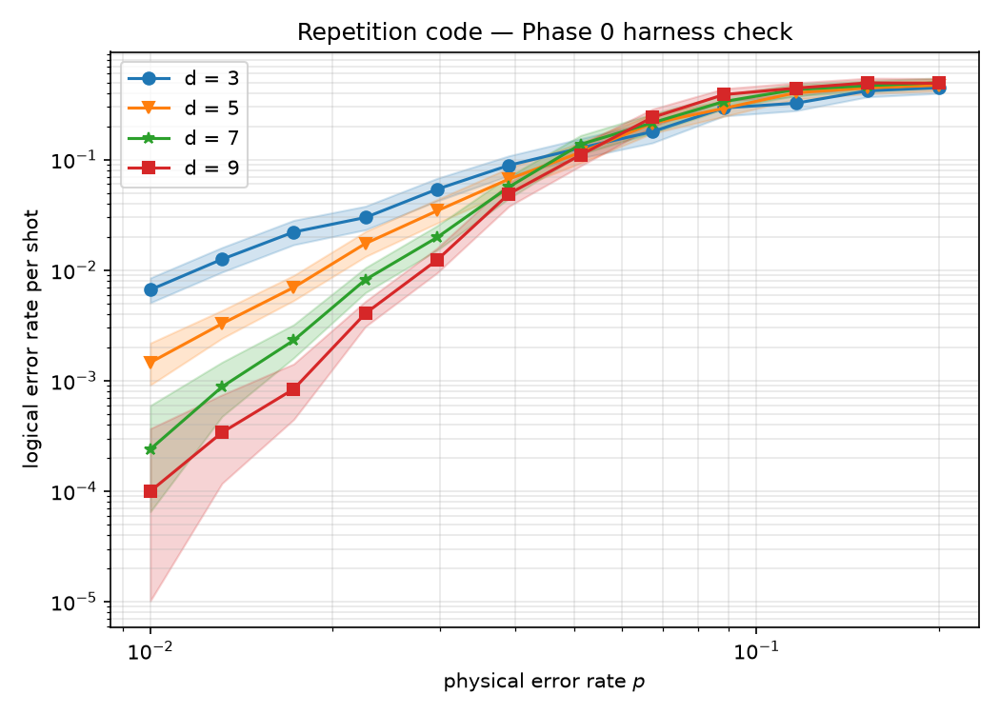

# QEC Decoder Study

Benchmarking **quantum error correction decoders** on the rotated surface code
under circuit-level noise: logical accuracy *and* decoding latency, measured
through one uniform interface so the comparison is fair by construction.

Built on the standard QEC research stack ([Stim](https://github.com/quantumlib/Stim),
[Sinter](https://pypi.org/project/sinter/),
[PyMatching](https://github.com/oscarhiggott/PyMatching),
[ldpc](https://github.com/quantumgizmos/ldpc)) rather than gate-level
simulators. Threshold studies need millions of Monte-Carlo shots.

## Results so far

### 1. Surface-code threshold, reproduced quantitatively

The rotated surface code (d = 3, 5, 7) under uniform circuit-level depolarizing
noise, decoded with minimum-weight perfect matching, yields

> **p_th = 0.622% ± 0.014%** (critical exponent ν = 1.20 ± 0.06)

extracted by a joint finite-size scaling fit. The fitted crossing, with
uncertainty, not an eyeballed one. This sits squarely in the accepted 0.5–1%
band and anchors every other measurement in the repo to a validated baseline.



### 2. Decoder benchmark: accuracy and latency on the same footing

MWPM (PyMatching), union-find (ldpc, inversion mode, prior-derived LLRs), and
BP+OSD-0 (ldpc, min-sum, 30 iterations) every decoder behind the same
bit-packed `sinter.CompiledDecoder` call path, decoding identical sampled data;
latency measured on shared fixed-seed syndrome batches (warm-up, median of 5).




At an operating point of p = 0.5% (below threshold, where a real machine must
run):

| Decoder | p_L at d=7 | trend with d | µs/shot at d=7 |
| --- | --- | --- | --- |
| MWPM | **8.6×10⁻³** | falls  | **6.9** |
| BP+OSD-0 | 2.2×10⁻² | ~flat | 2791 |
| Union-Find | 6.1×10⁻² | *rises* | 1780 |

Two takeaways:

- **MWPM dominates both axes simultaneously** on the surface code. Most
  accurate at every distance *and* orders of magnitude faster. Consistent
  with why matching decoders run today's flagship surface-code experiments.
- **The effective threshold moves with the decoder.** At p = 0.5%, adding
  qubits *helps* under MWPM but actively *hurts* under this union-find
  implementation. Decoder choice changes the code's operating envelope, not
  just a constant factor.

Caveats are part of the result: the latency numbers measure each library's
standard batch API as used in practice (PyMatching batches in C++; the ldpc
wrappers loop per shot in Python), and the UF/BP+OSD accuracy reflects these
implementations at these settings, not bounds on the algorithms.

### Harness validation

The pipeline was first validated end-to-end on the repetition code
(a 1-D matching graph which is the simplest system with a real threshold):



## Reproduce

```bash
python -m venv .venv
./.venv/Scripts/python.exe -m pip install -r requirements.txt   # Windows
# source .venv/bin/activate && pip install -r requirements.txt  # Linux/macOS

./.venv/Scripts/python.exe -m pytest                     # wiring check, 20 tests

./.venv/Scripts/python.exe -u experiments/repetition_threshold.py
./.venv/Scripts/python.exe -u experiments/surface_threshold.py
./.venv/Scripts/python.exe -u experiments/decoder_benchmark.py
```

Every figure above regenerates from these three scripts; sampling budgets are
adjustable via `--max-shots` / `--max-errors` flags.

## Status

Actively developed — decoder behaviour under further noise models is being
studied on top of this baseline.
